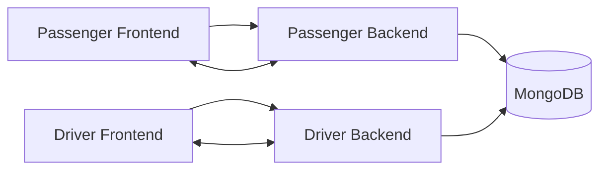

# Van Queue System

[](#installation)
[](#built-with)
[](#built-with)

## Table of Contents

- [Description](#description)
- [Key Features](#key-features)
- [Visuals](#visuals)
- [Built With](#built-with)
- [Installation](#installation)
- [Usage](#usage)
- [Contributing](#contributing)
- [License](#license)
- [Project Structure](#project-structure)
- [Environment Variables](#environment-variables)
- [Troubleshooting](#troubleshooting)

## Description

Van Queue System is a van queue and booking management platform for both passenger and driver workflows.

The repository contains two related applications:

- `Van_Client_Side` for passengers
- `Van-Driver-Side` for drivers

The main goal is to manage queueing, booking, route data, and live status updates in a single system that can be run locally with Docker Compose, including the database layer.

## Key Features

- Passenger-side web app with booking and queue management
- Driver-side web app with operational controls
- Backend APIs for each side
- MongoDB-based persistence
- Socket.IO support for live updates
- Docker Compose setup for one-command startup
- Environment-based configuration for local and production-style runs

## Visuals

### System Overview



### Repository Layout

```text
Van-Queue-System/
├── Van_Client_Side/
│   ├── backend/
│   ├── frontend/
│   ├── docker-compose.yml
│   ├── routes.json
│   └── trips.json
└── Van-Driver-Side/
    ├── backend/
    ├── frontend/
    └── docker-compose.yml
```

## Built With

- Node.js
- Express
- MongoDB
- React
- Vite
- Socket.IO
- Docker
- Docker Compose
- Tailwind CSS

## Installation

### Prerequisites

- Docker Desktop or Docker Engine with Docker Compose v2
- Git
- A terminal that can run shell commands

### Clone the repository

```bash
git clone <your-repo-url>
cd Van-Queue-System
```

### Run the passenger side first

The passenger stack includes MongoDB, so run it before the driver stack.

```bash
cd Van_Client_Side
docker compose up -d --build
```

This starts:

- `mongo`
- `mongo-rs-init`
- `backend`
- `frontend`

### Then run the driver side

```bash
cd ../Van-Driver-Side
docker compose up -d --build
```

### Open the apps

- Passenger frontend: `http://localhost:8080`
- Passenger API: `http://localhost:4000`
- Driver frontend: `http://localhost:3001`
- Driver API: `http://localhost:5000`

## Environment Variables

The repository is already configured with sensible defaults in `docker-compose.yml`, but you can override them with `.env.docker` if needed.

### Passenger side

Backend:

- `MONGO_URI` or `MONGODB_URI`
- `JWT_SECRET`
- `JWT_EXPIRES_IN`
- `CLIENT_URL`
- `DEPARTURE_NOTIFY_SECRET`
- `SEAT_HOLD_SECONDS`
- `UNPAID_CUTOFF_MINUTES`
- `PAID_LATE_MINUTES`
- `UPLOAD_DIR`

Frontend:

- `VITE_API_URL`
- `VITE_DRIVER_SOCKET_URL`

Example local values:

```env
JWT_SECRET=change-this-secret-key-in-production-2026
CLIENT_URL=http://localhost:8080
DEPARTURE_NOTIFY_SECRET=local-departure-secret
VITE_API_URL=http://localhost:4000
VITE_DRIVER_SOCKET_URL=http://localhost:5000
```

### Driver side

Backend:

- `MONGO_URI` or `MONGODB_URI`
- `JWT_SECRET`
- `JWT_EXPIRES_IN`
- `CLIENT_URL`
- `PASSENGER_BASE_URL`
- `PASSENGER_API_URL`
- `DEPARTURE_NOTIFY_SECRET`

Frontend:

- `VITE_API_URL`
- `VITE_SOCKET_URL`

Example local values:

```env
JWT_SECRET=van-queue-secret-key-2026
CLIENT_URL=http://localhost:3001,http://localhost:8080
PASSENGER_BASE_URL=http://localhost:8080
PASSENGER_API_URL=http://localhost:4000
DEPARTURE_NOTIFY_SECRET=change-this-secret
VITE_API_URL=http://localhost:5000
VITE_SOCKET_URL=http://localhost:5000
```

### Docker env files

You can also use the prepared files:

- `Van_Client_Side/.env.docker`
- `Van-Driver-Side/.env.docker`

Example:

```bash
docker compose --env-file .env.docker up -d --build
```

## Usage

### Start the stacks

```bash
cd Van_Client_Side
docker compose up -d --build

cd ../Van-Driver-Side
docker compose up -d --build
```

### Check logs

```bash
docker compose logs -f
```

### Stop the services

```bash
docker compose down
```

### Remove the passenger database volume

```bash
docker compose down -v
```

### Local development without Docker

Passenger backend:

```bash
cd Van_Client_Side/backend
npm install
npm run dev
```

Passenger frontend:

```bash
cd Van_Client_Side/frontend
npm install
npm run dev
```

Driver backend:

```bash
cd Van-Driver-Side/backend
npm install
npm run dev
```

Driver frontend:

```bash
cd Van-Driver-Side/frontend
npm install
npm run dev
```

## Contributing

Contributions are welcome.

If you want to help, please:

1. Fork or create a branch.
2. Make changes in a focused way.
3. Test the app with Docker Compose if your change affects startup or env config.
4. Open a pull request with a clear summary of what changed.

Recommended contribution workflow:

- Keep commits small and descriptive
- Do not overwrite unrelated user changes
- Update the README if your change affects setup or usage

If the project grows, you can move these rules into a separate `CONTRIBUTING.md` file later.

## License

No license file is currently included in this repository.

If you plan to publish or share the project publicly, add a `LICENSE` file first and choose a license such as MIT or Apache 2.0.

## Project Structure

```text
Van-Queue-System/
├── Van_Client_Side/
│   ├── backend/
│   ├── frontend/
│   ├── docker-compose.yml
│   ├── .env.docker
│   ├── routes.json
│   └── trips.json
└── Van-Driver-Side/
    ├── backend/
    ├── frontend/
    ├── docker-compose.yml
    └── .env.docker
```

## Troubleshooting

- If the backend cannot connect to MongoDB, make sure the passenger stack is running first.
- If the driver stack cannot see the passenger database on Linux, verify `host.docker.internal` support or update the Mongo URI.
- If the frontend cannot reach the API, verify `VITE_API_URL` and `VITE_SOCKET_URL`.
- If you want to reset the passenger database, run `docker compose down -v` inside `Van_Client_Side`.

